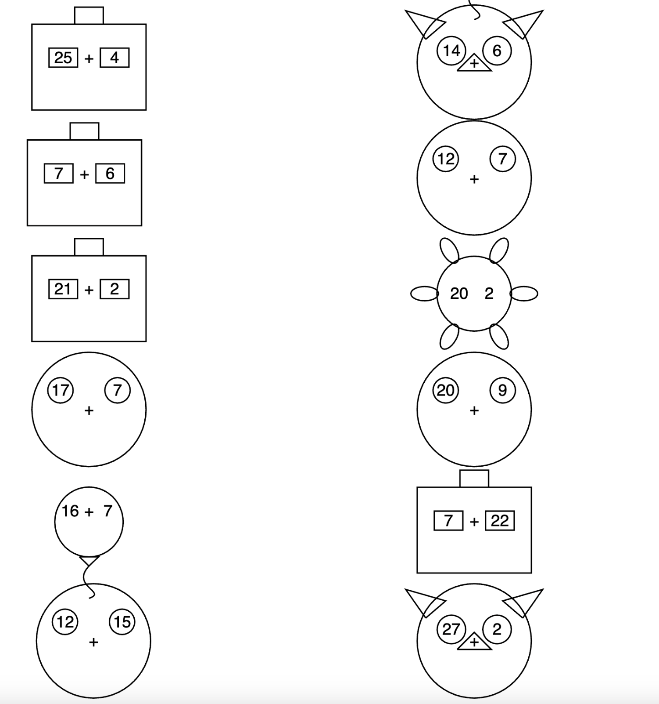

### Math Practice for Kindergarteners
Use this to generate a PDF with math problems for kindergarteners.
Look at examples in the output folder. There is a pdf with each shape that is available. When you run the code it will generate a single pdf with all the shapes picked randomly.

### Sample Output


### How to run
```
python print.py
```

If you are running this for the first time, you will need to install the dependencies. The pre-requisites are a modern python3 (>3.10) 
```
python3 -m venv venv
source venv/bin/activate
pip install -r requirements.txt
```


### How to add new shapes
1. Add a new shape class in the shapes.py file. Look at the base class for the interface needed as well as existing shapes for examples.
2. Add a new shape in the ShapeFactory.create_random_shape function.

### TODO
1. Add more shapes
2. Sort the problems by difficulty, easiest one first. 
3. Make designing problems configurable.
